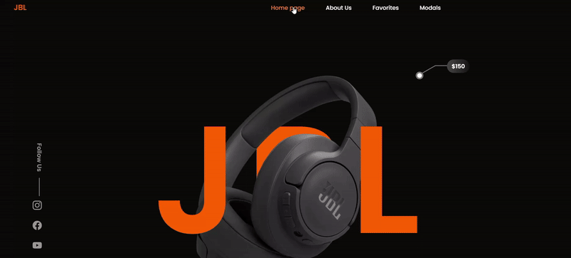

# JBL Klon

Bu proje, JBL markasına ait kulaklık modellerinin tanıtıldığı bir web sitesinin görsel ve işlevsel açıdan bir benzeridir. Projede HTML ve SCSS kullanılarak modern, duyarlı (responsive) ve kullanıcı dostu bir tasarım yapılmıştır.

# Özellikler

Değişkenler: Renk paletleri ve yazı tipleri gibi tasarım unsurları için.

Mixin’ler: Tekrarlanan kodları minimize etmek için.

Modüler Yapı: SCSS dosyaları bileşenlere göre bölünerek düzenli bir yapı sağlanmıştır.

SCSS kullanılarak mobil, tablet ve masaüstü cihazlar için optimize edilmiş bir düzen sunulmuştur.

Flexbox ve Grid ile düzenli ve esnek bir tasarım.

# Kullanılan Teknolojiler

HTML
SCSS

# Ekran Görüntüsü

